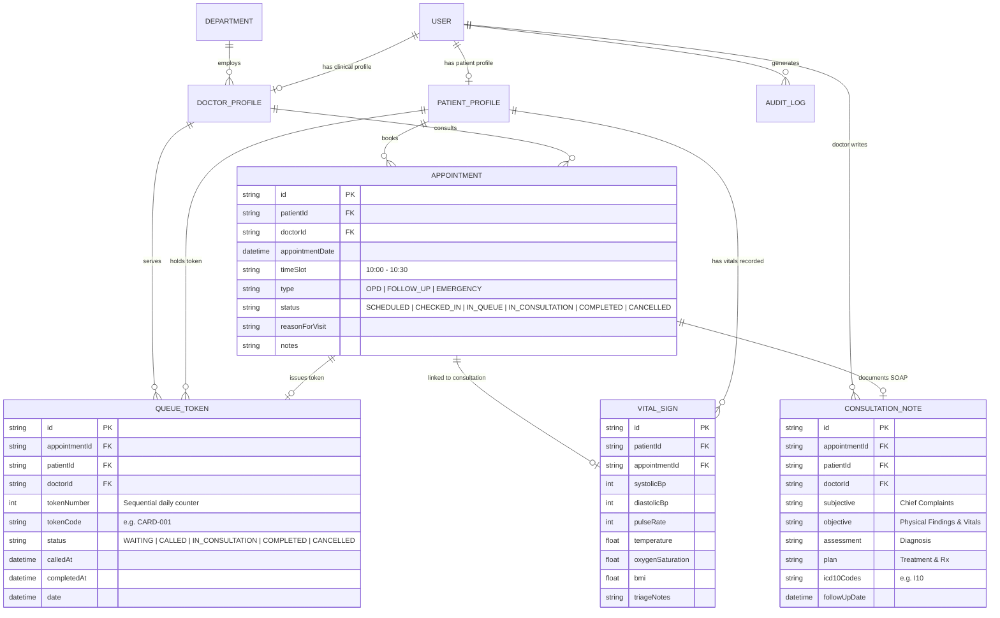

# 🏥 Smart Hospital Management System (HMS)

> **Cloud-Based Healthcare Management & Clinical Operations Platform**  
> **Student / Intern Name:** Muhammad Tabish Ahmad  
> **Internship ID:** `ZYNVEX-CERT-1101`  
> **Repository:** [Smart-Hospital-management-system](https://github.com/ansariking51214/Smart-Hospital-management-system)

---

## 📌 Project Overview
The **Smart Hospital Management System (HMS)** is an enterprise-grade full-stack healthcare web application designed to automate clinical operations, outpatient scheduling, dynamic time slot booking, electronic health records (EHR), physician shift rostering, OPD live queue & token calling, nurse vitals triage desk & early warning scoring, consultation status flows & SOAP notes, pharmacy dispensing, inpatient bed tracking, and billing workflows.

---

## 🚀 Internship Syllabus & Milestone Progress

### ✅ Module 1: Authentication, RBAC & Patient Registration (100% Completed)
| Day | Date | Focus Scope | Key Deliverables | Status |
|:---:|:---:|:---|:---|:---:|
| **Day 1** | Aug 24 | DB Schema Design & Scaffolding | 11 Prisma Relational Models, SQLite Migration, Seed Data Fixtures | ✅ **Completed** |
| **Day 2** | Aug 25 | JWT Auth & Password Security | BCrypt (10 Salt Rounds), Signed JWT Engine, Token Inspector, Audit Trail | ✅ **Completed** |
| **Day 3** | Aug 26 | Role-Based Access Control (RBAC) | 6 Roles, 20+ Permissions Matrix, Dynamic Route Guards, Admin Role Table | ✅ **Completed** |
| **Day 4** | Aug 27 | Patient Registration & Auto MRN | Sequential Auto-MRN (`MRN-2026-XXXX`), 4-Step Clinical Intake, Digital ID Card | ✅ **Completed** |
| **Day 5** | Aug 28 | Patient Search & Medical History | Multi-Criteria Search, Longitudinal EHR Timeline, Emergency Contact Center | ✅ **Completed** |

---

### 🩺 Module 2: Doctor Rostering & OPD Management (100% Completed ✅)
| Day | Date | Focus Scope | Key Deliverables | Status |
|:---:|:---:|:---|:---|:---:|
| **Day 1** | Aug 31 / Sep 01 | Doctor Profile & Shift Rostering | Physician Onboarding, Shift Schedules, Weekly Rosters, Real-time Duty Board | ✅ **Completed** |
| **Day 2** | Sep 02 | Slot Booking Engine & OPD Scheduling | Dynamic Slot Generation, Collision Guard, Queue Token Issuance & Rescheduling | ✅ **Completed** |
| **Day 3** | Sep 03 | OPD Queue & Token Display System | Live Patient Calling Board, Sequential Tokens, TV Display Screen, Triage Desk | ✅ **Completed** |
| **Day 4** | Sep 04 | Nurse Vitals Triage Desk & Alerts | Pre-Consultation Vitals, Auto-BMI, NEWS Early Warning Severity Alerts (Green/Amber/Red) | ✅ **Completed** |
| **Day 5** | Sep 05 | **Appointment Status & Consultation Flow** | **End-to-End Outpatient Lifecycle, Patient Check-In, Clinical SOAP Documentation, Visit Checkout & Longitudinal Journey Timeline** | ✅ **Completed & Verified** |

---

## 🩺 Module 2 — Complete Deliverables Breakdown (Days 1 — 5)

### 📅 Day 1: Doctor Profile & Clinical Shift Rostering
* **Controller:** [`server/src/controllers/doctorRosterController.js`](https://github.com/ansariking51214/Smart-Hospital-management-system/blob/main/server/src/controllers/doctorRosterController.js)
* **Frontend:** [`client/src/components/Day1DoctorRosterExplorer.jsx`](https://github.com/ansariking51214/Smart-Hospital-management-system/blob/main/client/src/components/Day1DoctorRosterExplorer.jsx)
* **Features:** Physician profile onboarding, weekly shift scheduling, consultation room allocation, and active duty roster board.
* **Test Suite:** [`server/test-doctor-roster.js`](https://github.com/ansariking51214/Smart-Hospital-management-system/blob/main/server/test-doctor-roster.js) (**18/18 Passed**).

### 📅 Day 2: Dynamic Slot Booking Engine & OPD Scheduling
* **Controller:** [`server/src/controllers/appointmentBookingController.js`](https://github.com/ansariking51214/Smart-Hospital-management-system/blob/main/server/src/controllers/appointmentBookingController.js)
* **Frontend:** [`client/src/components/Day2AppointmentBookingExplorer.jsx`](https://github.com/ansariking51214/Smart-Hospital-management-system/blob/main/client/src/components/Day2AppointmentBookingExplorer.jsx)
* **Features:** Dynamic 30-minute time slot generation from shift hours (`09:00 - 15:00`), double-booking collision guard, automated queue token issuance, 1-click rescheduling, and cancellation.
* **Test Suite:** [`server/test-appointment-booking.js`](https://github.com/ansariking51214/Smart-Hospital-management-system/blob/main/server/test-appointment-booking.js) (**18/18 Passed**).

### 📅 Day 3: OPD Live Queue & Token Display System
* **Controller:** [`server/src/controllers/opdQueueController.js`](https://github.com/ansariking51214/Smart-Hospital-management-system/blob/main/server/src/controllers/opdQueueController.js)
* **Frontend:** [`client/src/components/Day3OpdQueueExplorer.jsx`](https://github.com/ansariking51214/Smart-Hospital-management-system/blob/main/client/src/components/Day3OpdQueueExplorer.jsx)
* **Features:** Live OPD Queue Stream (`/api/queue/live`), 1-Click "Call Next Patient" paging desk, public waiting hall TV display mode with pulsing "NOW SERVING" cards, walk-in token issuance, and estimated wait-time algorithms.
* **Test Suite:** [`server/test-opd-queue.js`](https://github.com/ansariking51214/Smart-Hospital-management-system/blob/main/server/test-opd-queue.js) (**18/18 Passed**).

### 📅 Day 4: Nurse Vitals Triage Desk & Early Warning System
* **Controller:** [`server/src/controllers/nurseTriageController.js`](https://github.com/ansariking51214/Smart-Hospital-management-system/blob/main/server/src/controllers/nurseTriageController.js)
* **Frontend:** [`client/src/components/Day4NurseTriageExplorer.jsx`](https://github.com/ansariking51214/Smart-Hospital-management-system/blob/main/client/src/components/Day4NurseTriageExplorer.jsx)
* **Features:** Pre-consultation vital signs screening (BP, Pulse, SpO2, Temp, RR, Height, Weight), real-time Auto-BMI calculator, and NEWS Clinical Early Warning Scoring (Green Stable, Amber Urgent, Red Critical alerts).
* **Test Suite:** [`server/test-nurse-triage.js`](https://github.com/ansariking51214/Smart-Hospital-management-system/blob/main/server/test-nurse-triage.js) (**14/14 Passed**).

### 📅 Day 5: Appointment Status & Consultation Flow (End-to-End Outpatient Lifecycle)
* **Controller:** [`server/src/controllers/appointmentFlowController.js`](https://github.com/ansariking51214/Smart-Hospital-management-system/blob/main/server/src/controllers/appointmentFlowController.js)
* **Routes:** [`server/src/routes/appointmentFlowRoutes.js`](https://github.com/ansariking51214/Smart-Hospital-management-system/blob/main/server/src/routes/appointmentFlowRoutes.js) mounted on `/api/appointment-flow`
* **Frontend:** [`client/src/components/Day5AppointmentFlowExplorer.jsx`](https://github.com/ansariking51214/Smart-Hospital-management-system/blob/main/client/src/components/Day5AppointmentFlowExplorer.jsx)
* **Features:**
  * **OPD Floor Kanban / Pipeline Flow Board:** 4 real-time stages: (1) Booked / Scheduled &rarr; (2) Checked-In / Waiting Hall &rarr; (3) In Active Consultation &rarr; (4) Completed & Checked Out.
  * **Clinical SOAP Consultation Documentation:** Full clinical notes capturing **Subjective (S)**, **Objective (O)**, **Assessment / Diagnosis (A)** with ICD-10 coding, and **Treatment Plan (P)**.
  * **Longitudinal Patient Journey Timeline:** 5-step visual audit trail tracking each milestone from initial booking through checkout.
  * **Follow-up Consultation Scheduler:** 1-Click return visit booking.
* **Test Suite:** [`server/test-appointment-flow.js`](https://github.com/ansariking51214/Smart-Hospital-management-system/blob/main/server/test-appointment-flow.js) (**16/16 Passed**).

---

## 🏗️ Architecture & Entity Relationship Diagram (ERD)



---

## 🧪 Automated Test Suite Coverage (176 Total Passed Assertions across 9 Suites)

| Test Suite File | Module & Day Scope | Assertions | Result |
|:---|:---|:---:|:---:|
| [`server/test-auth.js`](https://github.com/ansariking51214/Smart-Hospital-management-system/blob/main/server/test-auth.js) | M1 Day 2: JWT Auth, Hashing, Token Tampering | 23 | ✅ **100% PASS** |
| [`server/test-rbac.js`](https://github.com/ansariking51214/Smart-Hospital-management-system/blob/main/server/test-rbac.js) | M1 Day 3: RBAC Matrix, Route Guards & Admin | 36 | ✅ **100% PASS** |
| [`server/test-patient-registration.js`](https://github.com/ansariking51214/Smart-Hospital-management-system/blob/main/server/test-patient-registration.js) | M1 Day 4: Auto-MRN & Demographic Intake | 17 | ✅ **100% PASS** |
| [`server/test-medical-history.js`](https://github.com/ansariking51214/Smart-Hospital-management-system/blob/main/server/test-medical-history.js) | M1 Day 5: Multi-Criteria Search & Longitudinal EHR | 16 | ✅ **100% PASS** |
| [`server/test-doctor-roster.js`](https://github.com/ansariking51214/Smart-Hospital-management-system/blob/main/server/test-doctor-roster.js) | M2 Day 1: Doctor Profile & Shift Rostering | 18 | ✅ **100% PASS** |
| [`server/test-appointment-booking.js`](https://github.com/ansariking51214/Smart-Hospital-management-system/blob/main/server/test-appointment-booking.js) | M2 Day 2: Slot Booking Engine & OPD Scheduling | 18 | ✅ **100% PASS** |
| [`server/test-opd-queue.js`](https://github.com/ansariking51214/Smart-Hospital-management-system/blob/main/server/test-opd-queue.js) | M2 Day 3: OPD Queue & Live Token Display | 18 | ✅ **100% PASS** |
| [`server/test-nurse-triage.js`](https://github.com/ansariking51214/Smart-Hospital-management-system/blob/main/server/test-nurse-triage.js) | M2 Day 4: Nurse Vitals Triage & Early Warning Alerts | 14 | ✅ **100% PASS** |
| [`server/test-appointment-flow.js`](https://github.com/ansariking51214/Smart-Hospital-management-system/blob/main/server/test-appointment-flow.js) | **M2 Day 5: Appointment Status & Consultation Flow** | 16 | ✅ **100% PASS** |
| **Total Test Coverage** | **All Modules (Module 1 Complete + Module 2 Complete)** | **176 Assertions** | ✅ **100% Passed** |

---

## ⚡ Quick Start & Setup Guide

### 1. Backend Server Setup
```powershell
cd server
npm install
npx prisma generate
npx prisma db push
node prisma/seed.js

# Run All 9 Automated Test Suites (176 Total Assertions):
node test-auth.js
node test-rbac.js
node test-patient-registration.js
node test-medical-history.js
node test-doctor-roster.js
node test-appointment-booking.js
node test-opd-queue.js
node test-nurse-triage.js
node test-appointment-flow.js

# Start Backend Server (Port 5000):
npm run dev
```

### 2. Frontend Client Setup
```powershell
cd ../client
npm install
npm run dev
```
Open **[http://localhost:5173](http://localhost:5173)** in your browser.

---

**Author:** [ansariking51214](https://github.com/ansariking51214)  
**Internship ID:** `ZYNVEX-CERT-1101`  
**Repository:** [https://github.com/ansariking51214/Smart-Hospital-management-system](https://github.com/ansariking51214/Smart-Hospital-management-system)
