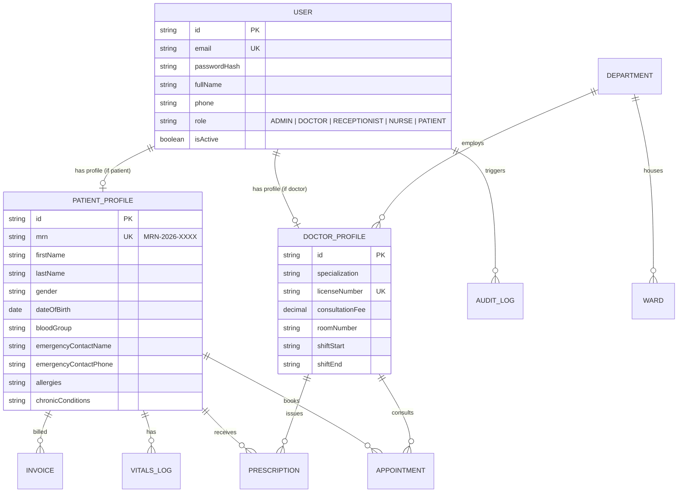

# 🏥 Smart Hospital Management System (HMS)

> **Cloud-Based Healthcare Management & Clinical Operations Platform**  
> **Internship Project Submission — Module 1: Day 1 Deliverable**

---

## 📌 Project Overview
The **Cloud-Based Hospital Management System (HMS)** is an enterprise-grade healthcare web application designed to automate clinical workflows, patient registration, outpatient scheduling, EHR consultations, pharmacy dispensing, inpatient bed tracking, and billing.

---

## 🚀 Module 1 — Day 1 Deliverables (Aug 24, 2026)

### ✅ What was completed on Day 1:
1. **Full-Stack Project Scaffolding:**
   - Modular structure with Express.js backend (`server/`) and React + Tailwind CSS client (`client/`).
   - Unified orchestration scripts, CORS, Helmet security headers, and environment variable configuration.
2. **Database Schema Design (Prisma ORM):**
   - **User & RBAC:** Enum roles (`ADMIN`, `DOCTOR`, `RECEPTIONIST`, `NURSE`, `PHARMACIST`, `PATIENT`).
   - **Doctor Profiles:** Specialization, room number, shift timing, consultation fee, license numbers.
   - **Patient Demographics:** Medical Record Number (MRN) standard `MRN-YYYY-XXXX`, emergency contacts, allergies, blood groups, and chronic conditions.
   - **Departments:** Clinical unit management (`Cardiology`, `Pediatrics`, `Neurology`, etc.).
   - **Audit Logs:** Immutable security trail for login and entity mutations.
   - **Future-Proof Models:** Database hooks and relations ready for Module 2 (Appointments, OPD Queue, Vitals), Module 3 (EHR SOAP notes, e-Prescriptions, Lab orders), and Module 4 (Pharmacy inventory, Ward Beds, Invoices).
3. **Automated Identifiers & Seed Data Fixtures:**
   - Collision-safe sequential `MRN` generator (`MRN-2026-0001` format).
   - Database seeding script with multi-role accounts and patient profiles.
4. **Interactive Day 1 Dashboard & Schema Inspector:**
   - Real-time API health diagnostics and schema explorer.

---

## 🏗️ Entity Relationship Diagram (ERD)



---

## 🛠️ Tech Stack

| Layer | Technologies |
|---|---|
| **Frontend** | React 18, Vite, Tailwind CSS, Lucide React Icons, Axios |
| **Backend API** | Node.js, Express.js (ESM), Helmet, Morgan, CORS |
| **Database & ORM** | Prisma ORM, SQLite (Zero-config local) / PostgreSQL compatible |
| **Auth & Security** | JWT (JSON Web Tokens), BCrypt.js, RBAC Middleware |
| **Utilities** | MRN Generator, Custom Error Handlers, Seed Scripts |

---

## 📂 Project Structure

```
Smart-Hospital-management-/
├── package.json                   # Root scripts
├── .gitignore
├── README.md
│
├── server/                        # Backend REST API
│   ├── prisma/
│   │   ├── schema.prisma          # Database schema (11 Models)
│   │   └── seed.js                # Seed script with demo clinical data
│   ├── src/
│   │   ├── config/                # Database singleton
│   │   │   └── db.js
│   │   ├── controllers/           # Health & Schema inspection controllers
│   │   │   ├── healthController.js
│   │   │   └── schemaController.js
│   │   ├── middleware/            # Error & logging middlewares
│   │   │   ├── errorHandler.js
│   │   │   └── requestLogger.js
│   │   ├── routes/                # API routes
│   │   │   ├── api.js
│   │   │   ├── healthRoutes.js
│   │   │   └── schemaRoutes.js
│   │   ├── utils/                 # MRN & Invoice number generator
│   │   │   └── mrnGenerator.js
│   │   ├── app.js                 # Express application
│   │   └── server.js              # Server entry point
│   ├── .env.example
│   └── package.json
│
└── client/                        # Frontend React Application
    ├── src/
    │   ├── components/            # UI components
    │   │   ├── Navbar.jsx
    │   │   ├── Sidebar.jsx
    │   │   ├── StatsCards.jsx
    │   │   ├── Day1SchemaExplorer.jsx
    │   │   ├── SeedDataViewer.jsx
    │   │   └── ModuleTimeline.jsx
    │   ├── services/              # API Client (Axios)
    │   │   └── api.js
    │   ├── App.jsx                # Main Application shell
    │   ├── main.jsx
    │   └── index.css              # Tailwind CSS
    ├── index.html
    ├── vite.config.js
    ├── tailwind.config.js
    └── package.json
```

---

## ⚡ Quick Start & Setup

### 1. Install & Run Backend
```bash
cd server
npm install
npx prisma generate
npx prisma db push
node prisma/seed.js
npm run dev
```
*Backend runs on `http://localhost:5000` (Health check: `/api/health`)*

### 2. Install & Run Frontend
```bash
cd ../client
npm install
npm run dev
```
*Frontend runs on `http://localhost:5173`*

---

## 🔐 Seed Demo Credentials for Testing

| Role | Email | Password | Access Scope |
|---|---|---|---|
| **Super Admin** | `admin@hms.hospital` | `Admin@12345` | Full System Management & Audit |
| **Cardiologist** | `dr.sarah@hms.hospital` | `Password@123` | Doctor Consultation & EHR |
| **Pediatrician** | `dr.ahmed@hms.hospital` | `Password@123` | OPD & Pediatric Consultation |
| **Receptionist** | `receptionist@hms.hospital` | `Password@123` | Patient Registration & Tokens |
| **Nurse** | `nurse.maria@hms.hospital` | `Password@123` | Triage & Vital Signs Recording |
| **Patient** | `david.miller@gmail.com` | `Password@123` | Patient Portal (MRN-2026-0001) |

---

## 📅 Next Upcoming Milestones (Module 1)
- **Day 2:** JWT Authentication (Login, Signup, Logout, Password Hashing).
- **Day 3:** Role-Based Access Control (RBAC Middleware & Route Guards).
- **Day 4:** Patient Registration & Demographic Intake Forms.
- **Day 5:** Patient Search, Emergency Contacts & Medical History Logging.

---

**Author:** [ansariking51214](https://github.com/ansariking51214)  
**Repository:** [Smart-Hospital-management-system](https://github.com/ansariking51214/Smart-Hospital-management-system.git)
