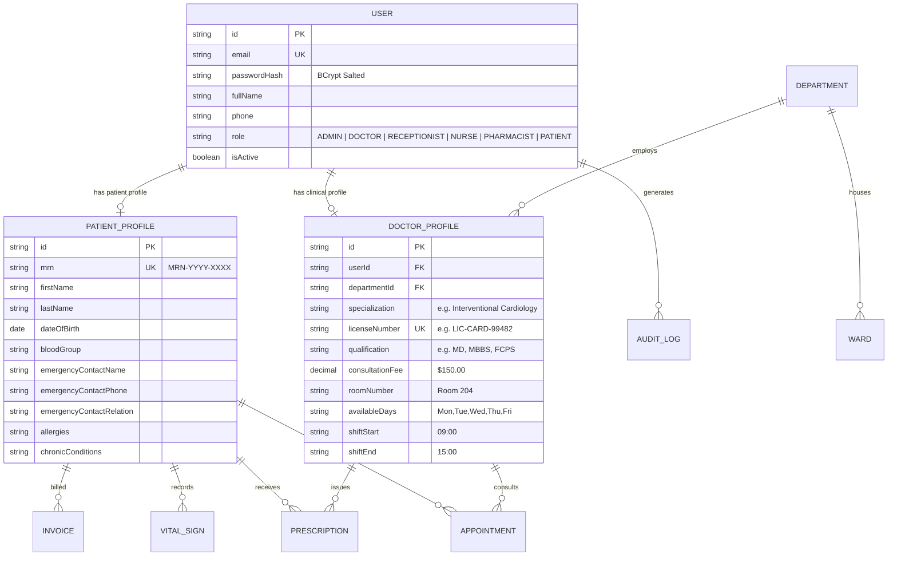

# 🏥 Smart Hospital Management System (HMS)

> **Cloud-Based Healthcare Management & Clinical Operations Platform**  
> **Student / Intern Name:** Muhammad Tabish Ahmad  
> **Internship ID:** `ZYNVEX-CERT-110`  
> **Repository:** [Smart-Hospital-management-system](https://github.com/ansariking51214/Smart-Hospital-management-system)

---

## 📌 Project Overview
The **Smart Hospital Management System (HMS)** is an enterprise-grade full-stack healthcare web application designed to automate clinical operations, outpatient scheduling, electronic health records (EHR), physician shift rostering, pharmacy dispensing, inpatient bed tracking, and billing workflows.

---

## 🚀 Internship Syllabus & Milestone Progress

### ✅ Module 1: Authentication, RBAC & Patient Registration (100% Completed)
| Day | Date | Focus Scope | Key Deliverables | Status |
|:---:|:---:|:---|:---|:---:|
| **Day 1** | Aug 24 | DB Schema Design & Scaffolding | 11 Prisma Relational Models, SQLite Migration, Seed Data Fixtures | ✅ **Completed** |
| **Day 2** | Aug 25 | JWT Auth & Password Security | BCrypt (10 Salt Rounds), Signed JWT Engine, Token Inspector, Audit Trail | ✅ **Completed** |
| **Day 3** | Aug 26 | Role-Based Access Control (RBAC) | 6 Roles, 20+ Permissions Matrix, Dynamic Route Guards, Admin Role Table | ✅ **Completed** |
| **Day 4** | Aug 27 | Patient Registration & Auto MRN | Sequential Auto-MRN (`MRN-2026-XXXX`), 4-Step Clinical Intake, Digital ID Card | ✅ **Completed** |
| **Day 5** | Aug 28 | Patient Search & Medical History | Multi-Criteria Search, Longitudinal EHR Timeline, Emergency Contact Center | ✅ **Completed** |

---

### 🩺 Module 2: Doctor Rostering & OPD Management (In Progress)
| Day | Date | Focus Scope | Key Deliverables | Status |
|:---:|:---:|:---|:---|:---:|
| **Day 1** | Aug 31 / Sep 01 | **Doctor Profile & Shift Rostering** | **Physician Onboarding, Shift Schedules, Weekly Rosters, Real-time Duty Board** | ✅ **Completed & Verified** |
| **Day 2** | Sep 02 | Slot Booking Engine | Time Slot Generation & OPD Appointment Booking | ⏳ *Next Milestone* |
| **Day 3** | Sep 03 | OPD Queue & Token Display | Real-Time Live Queue Display & Token Calling | ⏳ *Upcoming* |
| **Day 4** | Sep 04 | Nurse Vitals Triage Desk | Clinical Vitals Recording & Triage Status | ⏳ *Upcoming* |
| **Day 5** | Sep 05 | Appointment Status Flow | Check-In, In-Consultation & Completion Workflow | ⏳ *Upcoming* |

---

## 🩺 Module 2 — Day 1 Deliverables: Doctor Profiles & Clinical Shift Rostering

### 1. Backend Shift Rostering Engine & API Endpoints
* **Controller:** [`server/src/controllers/doctorRosterController.js`](https://github.com/ansariking51214/Smart-Hospital-management-system/blob/main/server/src/controllers/doctorRosterController.js)
* **Routes:** [`server/src/routes/doctorRoutes.js`](https://github.com/ansariking51214/Smart-Hospital-management-system/blob/main/server/src/routes/doctorRoutes.js) mounted on `/api/doctors`
* **Validation:** [`server/src/middleware/validateDoctorRoster.js`](https://github.com/ansariking51214/Smart-Hospital-management-system/blob/main/server/src/middleware/validateDoctorRoster.js)

| Method | Endpoint | Access | Purpose |
|:---|:---|:---:|:---|
| `GET` | `/api/doctors` | Public / Staff | List all doctors with active shift schedules, room numbers & duty status |
| `GET` | `/api/doctors/:id` | Public / Staff | Retrieve single doctor's complete shift roster & clinical credentials |
| `POST` | `/api/doctors` | Admin Only | Onboard new physician, validate medical license & configure initial shift roster |
| `PUT` | `/api/doctors/:id/roster` | Admin / Doctor | Update weekly working days (`Mon-Sun`), shift hours (`Start-End`), room & fee |
| `GET` | `/api/doctors/stats/overview` | Public / Staff | Real-time shift roster analytics (Total Doctors, On-Duty Today, Avg Fee) |

### 2. Interactive Frontend Doctor Roster Explorer
* **React Component:** [`client/src/components/Day1DoctorRosterExplorer.jsx`](https://github.com/ansariking51214/Smart-Hospital-management-system/blob/main/client/src/components/Day1DoctorRosterExplorer.jsx)
* **Features:**
  * **Real-time Duty Board:** Visual indicator for On-Duty vs. Off-Duty based on current day of the week.
  * **1-Click Shift Roster Editor:** Interactive working days toggles (`Mon`, `Tue`, `Wed`, `Thu`, `Fri`, `Sat`, `Sun`), shift start/end pickers, and room assignments.
  * **Physician Onboarding Modal:** Admin interface for instant staff registration.

---

## 🏗️ Architecture & Entity Relationship Diagram (ERD)



---

## 🧪 Automated Test Suite Coverage (110 Total Passed Assertions)

All test suites run independently and test core business logic, schema constraints, validation rules, and security controls:

| Test Suite File | Module & Day Scope | Assertions | Result |
|:---|:---|:---:|:---:|
| [`server/test-auth.js`](https://github.com/ansariking51214/Smart-Hospital-management-system/blob/main/server/test-auth.js) | M1 Day 2: JWT Auth, Hashing, Token Tampering | 23 | ✅ **100% PASS** |
| [`server/test-rbac.js`](https://github.com/ansariking51214/Smart-Hospital-management-system/blob/main/server/test-rbac.js) | M1 Day 3: RBAC Matrix, Route Guards & Admin | 36 | ✅ **100% PASS** |
| [`server/test-patient-registration.js`](https://github.com/ansariking51214/Smart-Hospital-management-system/blob/main/server/test-patient-registration.js) | M1 Day 4: Auto-MRN & Demographic Intake | 17 | ✅ **100% PASS** |
| [`server/test-medical-history.js`](https://github.com/ansariking51214/Smart-Hospital-management-system/blob/main/server/test-medical-history.js) | M1 Day 5: Multi-Criteria Search & Longitudinal EHR | 16 | ✅ **100% PASS** |
| [`server/test-doctor-roster.js`](https://github.com/ansariking51214/Smart-Hospital-management-system/blob/main/server/test-doctor-roster.js) | **M2 Day 1: Doctor Profile & Shift Rostering** | 18 | ✅ **100% PASS** |
| **Total Test Coverage** | **All Modules (M1 Complete + M2 Day 1)** | **110 Assertions** | ✅ **100% Passed** |

---

## ⚡ Quick Start & Setup Guide

### 1. Clone Repository & Setup Backend
```powershell
git clone https://github.com/ansariking51214/Smart-Hospital-management-system.git
cd Smart-Hospital-management-system/server
npm install
npx prisma generate
npx prisma db push
node prisma/seed.js

# Run All Automated Test Suites:
node test-auth.js
node test-rbac.js
node test-patient-registration.js
node test-medical-history.js
node test-doctor-roster.js

# Start Backend Server (Port 5000):
npm run dev
```

### 2. Setup Frontend Client
```powershell
cd ../client
npm install
npm run dev
```
Open **[http://localhost:5173](http://localhost:5173)** in your browser.

---

## 🔐 Default Demo Accounts for Testing

| Role | Email | Password | Primary Capabilities |
|:---|:---|:---|:---|
| **Super Admin** | `admin@hms.hospital` | `Admin@12345` | Physician onboarding, role assignment, system configuration |
| **Cardiologist** | `dr.sarah@hms.hospital` | `Password@123` | Shift roster config, clinical consultations, e-prescriptions |
| **Pediatrician** | `dr.ahmed@hms.hospital` | `Password@123` | Pediatric clinic roster & appointment triage |
| **Receptionist** | `receptionist@hms.hospital` | `Password@123` | Patient demographic registration & OPD search |
| **Nurse** | `nurse.maria@hms.hospital` | `Password@123` | Triage vitals recording & emergency contact management |
| **Patient** | `david.miller@gmail.com` | `Password@123` | View personal EHR timeline & medical passport |

---

**Author:** [ansariking51214](https://github.com/ansariking51214)  
**Internship ID:** `ZYNVEX-CERT-110`  
**Repository:** [https://github.com/ansariking51214/Smart-Hospital-management-system](https://github.com/ansariking51214/Smart-Hospital-management-system)
