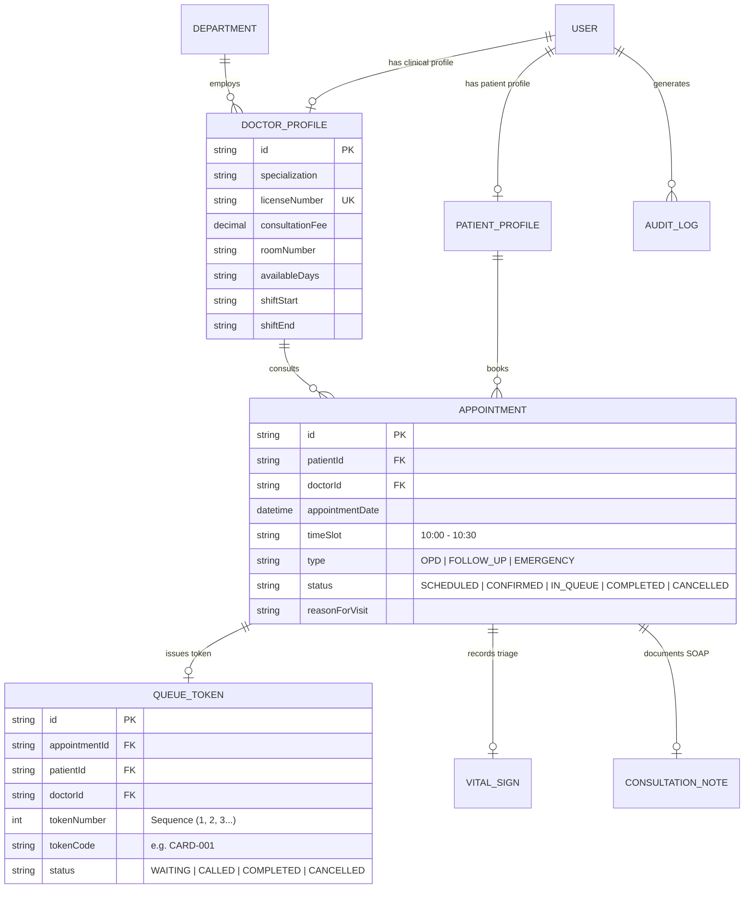

# 🏥 Smart Hospital Management System (HMS)

> **Cloud-Based Healthcare Management & Clinical Operations Platform**  
> **Student / Intern Name:** Muhammad Tabish Ahmad  
> **Internship ID:** `ZYNVEX-CERT-110`  
> **Repository:** [Smart-Hospital-management-system](https://github.com/ansariking51214/Smart-Hospital-management-system)

---

## 📌 Project Overview
The **Smart Hospital Management System (HMS)** is an enterprise-grade full-stack healthcare web application designed to automate clinical operations, outpatient scheduling, dynamic time slot booking, electronic health records (EHR), physician shift rostering, pharmacy dispensing, inpatient bed tracking, and billing workflows.

---

## 🚀 Internship Syllabus & Milestone Progress

### ✅ Module 1: Authentication, RBAC & Patient Registration (100% Completed)
| Day | Date | Focus Scope | Key Deliverables | Status |
|:---:|:---:|:---|:---|:---:|
| **Day 1** | Aug 24 | DB Schema Design & Scaffolding | 11 Prisma Relational Models, SQLite Migration, Seed Data Fixtures | ✅ **Completed** |
| **Day 2** | Aug 25 | JWT Auth & Password Security | BCrypt (10 Salt Rounds), Signed JWT Engine, Token Inspector, Audit Trail | ✅ **Completed** |
| **Day 3** | Aug 26 | Role-Based Access Control (RBAC) | 6 Roles, 20+ Permissions Matrix, Dynamic Route Guards, Admin Role Table | ✅ **Completed** |
| **Day 4** | Aug 27 | Patient Registration & Auto MRN | Sequential Auto-MRN (`MRN-2026-XXXX`), 4-Step Clinical Intake, Digital ID Card | ✅ **Completed** |
| **Day 5** | Aug 28 | Patient Search & Medical History | Multi-Criteria Search, Longitudinal EHR Timeline, Emergency Contact Center | ✅ **Completed** |

---

### 🩺 Module 2: Doctor Rostering & OPD Management (In Progress)
| Day | Date | Focus Scope | Key Deliverables | Status |
|:---:|:---:|:---|:---|:---:|
| **Day 1** | Aug 31 / Sep 01 | Doctor Profile & Shift Rostering | Physician Onboarding, Shift Schedules, Weekly Rosters, Real-time Duty Board | ✅ **Completed** |
| **Day 2** | Sep 02 | **Slot Booking Engine & OPD Scheduling** | **Dynamic Slot Generation, Collision Guard, Queue Token Issuance & Rescheduling** | ✅ **Completed & Verified** |
| **Day 3** | Sep 03 | OPD Queue & Token Display | Real-Time Live Queue Display & Token Calling | ⏳ *Next Milestone* |
| **Day 4** | Sep 04 | Nurse Vitals Triage Desk | Clinical Vitals Recording & Triage Status | ⏳ *Upcoming* |
| **Day 5** | Sep 05 | Appointment Status Flow | Check-In, In-Consultation & Completion Workflow | ⏳ *Upcoming* |

---

## 📅 Module 2 — Day 2 Deliverables: Slot Booking Engine & OPD Appointment Scheduling

### 1. Dynamic Time Slot Generator & Booking Engine
* **Controller:** [`server/src/controllers/appointmentBookingController.js`](https://github.com/ansariking51214/Smart-Hospital-management-system/blob/main/server/src/controllers/appointmentBookingController.js)
* **Routes:** [`server/src/routes/appointmentRoutes.js`](https://github.com/ansariking51214/Smart-Hospital-management-system/blob/main/server/src/routes/appointmentRoutes.js) mounted on `/api/appointments`
* **Validation:** [`server/src/middleware/validateAppointmentBooking.js`](https://github.com/ansariking51214/Smart-Hospital-management-system/blob/main/server/src/middleware/validateAppointmentBooking.js)

| Method | Endpoint | Access | Purpose |
|:---|:---|:---:|:---|
| `GET` | `/api/appointments/slots` | Public / Staff | Dynamically generates all time slots from physician shift hours, marks occupied/available slots |
| `POST` | `/api/appointments/book` | Authenticated | Books appointment with double-booking collision guard and issues automated `QueueToken` |
| `GET` | `/api/appointments` | Authenticated | List & filter appointments by date, doctor, patient, or status (`SCHEDULED`, `CONFIRMED`, `CANCELLED`) |
| `PATCH` | `/api/appointments/:id/reschedule` | Authenticated | Reschedules appointment to a new date/time slot with real-time conflict verification |
| `PATCH` | `/api/appointments/:id/cancel` | Authenticated | Cancels appointment and immediately releases the reserved slot for new bookings |
| `GET` | `/api/appointments/stats/overview` | Public / Staff | Live OPD booking statistics (Today's Total, Scheduled, Completed, Cancelled) |

### 2. Interactive Frontend Slot Booking Explorer
* **React Component:** [`client/src/components/Day2AppointmentBookingExplorer.jsx`](https://github.com/ansariking51214/Smart-Hospital-management-system/blob/main/client/src/components/Day2AppointmentBookingExplorer.jsx)
* **Features:**
  * **3-Step Booking Wizard:** (1) Select Doctor & Department, (2) Date Picker & Dynamic Slot Grid (Green = Available, Red = Booked), (3) Patient Selection & Instant Token Generation.
  * **Digital OPD Voucher & Queue Token Card:** Generates instant printable token vouchers (e.g. `CARD-001`, `PEDS-002`).
  * **Live Appointment Registry Board:** Filter appointments, 1-Click Reschedule modal, and 1-Click Cancellation.

---

## 🏗️ Architecture & Entity Relationship Diagram (ERD)



---

## 🧪 Automated Test Suite Coverage (128 Total Passed Assertions)

| Test Suite File | Module & Day Scope | Assertions | Result |
|:---|:---|:---:|:---:|
| [`server/test-auth.js`](https://github.com/ansariking51214/Smart-Hospital-management-system/blob/main/server/test-auth.js) | M1 Day 2: JWT Auth, Hashing, Token Tampering | 23 | ✅ **100% PASS** |
| [`server/test-rbac.js`](https://github.com/ansariking51214/Smart-Hospital-management-system/blob/main/server/test-rbac.js) | M1 Day 3: RBAC Matrix, Route Guards & Admin | 36 | ✅ **100% PASS** |
| [`server/test-patient-registration.js`](https://github.com/ansariking51214/Smart-Hospital-management-system/blob/main/server/test-patient-registration.js) | M1 Day 4: Auto-MRN & Demographic Intake | 17 | ✅ **100% PASS** |
| [`server/test-medical-history.js`](https://github.com/ansariking51214/Smart-Hospital-management-system/blob/main/server/test-medical-history.js) | M1 Day 5: Multi-Criteria Search & Longitudinal EHR | 16 | ✅ **100% PASS** |
| [`server/test-doctor-roster.js`](https://github.com/ansariking51214/Smart-Hospital-management-system/blob/main/server/test-doctor-roster.js) | M2 Day 1: Doctor Profile & Shift Rostering | 18 | ✅ **100% PASS** |
| [`server/test-appointment-booking.js`](https://github.com/ansariking51214/Smart-Hospital-management-system/blob/main/server/test-appointment-booking.js) | **M2 Day 2: Slot Booking Engine & OPD Scheduling** | 18 | ✅ **100% PASS** |
| **Total Test Coverage** | **All Modules (M1 Complete + M2 Days 1-2)** | **128 Assertions** | ✅ **100% Passed** |

---

## ⚡ Quick Start & Setup Guide

### 1. Backend Server Setup
```powershell
cd server
npm install
npx prisma generate
npx prisma db push
node prisma/seed.js

# Run All Automated Test Suites:
node test-auth.js
node test-rbac.js
node test-patient-registration.js
node test-medical-history.js
node test-doctor-roster.js
node test-appointment-booking.js

# Start Backend Server (Port 5000):
npm run dev
```

### 2. Frontend Client Setup
```powershell
cd ../client
npm install
npm run dev
```
Open **[http://localhost:5173](http://localhost:5173)** in your browser.

---

**Author:** [ansariking51214](https://github.com/ansariking51214)  
**Internship ID:** `ZYNVEX-CERT-110`  
**Repository:** [https://github.com/ansariking51214/Smart-Hospital-management-system](https://github.com/ansariking51214/Smart-Hospital-management-system)
