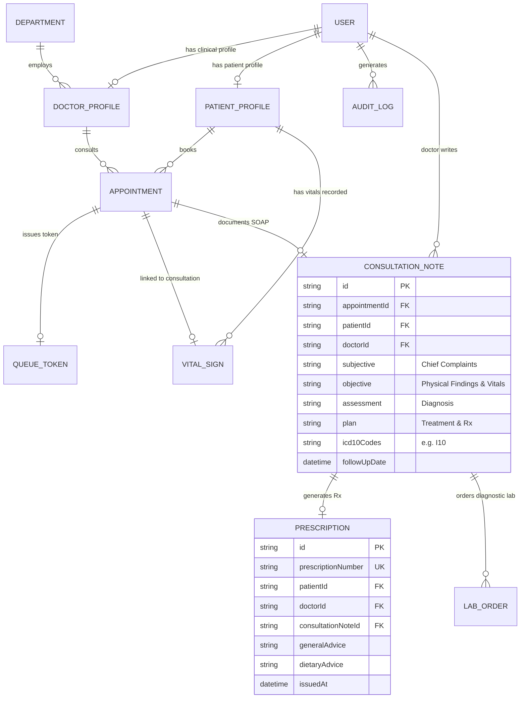

# 🏥 Smart Hospital Management System (HMS)

> **Cloud-Based Healthcare Management & Clinical Operations Platform**  
> **Student / Intern Name:** Muhammad Tabish Ahmad  
> **Internship ID:** `ZYNVEX-CERT-1101`  
> **Repository:** [Smart-Hospital-management-system](https://github.com/ansariking51214/Smart-Hospital-management-system)

---

## 📌 Project Overview
The **Smart Hospital Management System (HMS)** is an enterprise-grade full-stack healthcare web application designed to automate clinical operations, outpatient scheduling, dynamic time slot booking, electronic health records (EHR), physician shift rostering, OPD live queue & token calling, nurse vitals triage desk & early warning scoring, physician consultation workstations & SOAP notes, pharmacy dispensing, inpatient bed tracking, and billing workflows.

---

## 🚀 Internship Syllabus & Milestone Progress

### ✅ Module 1: Authentication, RBAC & Patient Registration (100% Completed)
| Day | Date | Focus Scope | Key Deliverables | Status |
|:---:|:---:|:---|:---|:---:|
| **Day 1** | Aug 24 | DB Schema Design & Scaffolding | 11 Prisma Relational Models, SQLite Migration, Seed Data Fixtures | ✅ **Completed** |
| **Day 2** | Aug 25 | JWT Auth & Password Security | BCrypt (10 Salt Rounds), Signed JWT Engine, Token Inspector, Audit Trail | ✅ **Completed** |
| **Day 3** | Aug 26 | Role-Based Access Control (RBAC) | 6 Roles, 20+ Permissions Matrix, Dynamic Route Guards, Admin Role Table | ✅ **Completed** |
| **Day 4** | Aug 27 | Patient Registration & Auto MRN | Sequential Auto-MRN (`MRN-2026-XXXX`), 4-Step Clinical Intake, Digital ID Card | ✅ **Completed** |
| **Day 5** | Aug 28 | Patient Search & Medical History | Multi-Criteria Search, Longitudinal EHR Timeline, Emergency Contact Center | ✅ **Completed** |

---

### ✅ Module 2: Doctor Rostering & OPD Management (100% Completed)
| Day | Date | Focus Scope | Key Deliverables | Status |
|:---:|:---:|:---|:---|:---:|
| **Day 1** | Aug 31 / Sep 01 | Doctor Profile & Shift Rostering | Physician Onboarding, Shift Schedules, Weekly Rosters, Real-time Duty Board | ✅ **Completed** |
| **Day 2** | Sep 02 | Slot Booking Engine & OPD Scheduling | Dynamic Slot Generation, Collision Guard, Queue Token Issuance & Rescheduling | ✅ **Completed** |
| **Day 3** | Sep 03 | OPD Queue & Token Display System | Live Patient Calling Board, Sequential Tokens, TV Display Screen, Triage Desk | ✅ **Completed** |
| **Day 4** | Sep 04 | Nurse Vitals Triage Desk & Alerts | Pre-Consultation Vitals, Auto-BMI, NEWS Early Warning Severity Alerts (Green/Amber/Red) | ✅ **Completed** |
| **Day 5** | Sep 05 | Appointment Status & Consultation Flow | End-to-End Outpatient Lifecycle, Patient Check-In, Clinical SOAP Documentation | ✅ **Completed** |

---

### 🩺 Module 3: EHR & e-Prescriptions (80% Completed)
| Day | Date | Focus Scope | Key Deliverables | Status |
|:---:|:---:|:---|:---|:---:|
| **Day 1** | Sep 07 | **Doctor Consultation UI & Clinical EHR** | **Physician Encounter Console, 360° Patient Snapshot, Vitals Radar, Critical Allergy Alerts & Outpatient Worklist** | ✅ **Completed & Verified** |
| **Day 2** | Sep 08 | **Clinical SOAP Notes** | **Structured Subjective, Objective, Assessment, Plan & Encounter Summary** | ✅ **Completed & Verified** |
| **Day 3** | Sep 09 | **ICD-10 & Allergy Interaction Alerts** | **Diagnostic Coding Catalog, Patient Allergy Screening, Drug-Drug Interaction Alert Engine** | ✅ **Completed & Verified** |
| **Day 4** | Sep 10 | **e-Prescribing Engine** | **Structured medication orders, server-side allergy/interaction safety gate, prescription numbering, audit trail & patient prescription history** | ✅ **Completed & Verified** |
| **Day 5** | Sep 11 | Lab Orders & PDF Export | Diagnostic Lab Orders, Results Tracking & Clinical PDF Summary | ⏳ *Upcoming* |

---

## 🩺 Module 3 — Day 1 Deliverables: Doctor Consultation UI & Clinical EHR Workspace

### 1. Physician Clinical Encounter Core & API Endpoints
* **Controller:** [`server/src/controllers/doctorConsultationController.js`](https://github.com/ansariking51214/Smart-Hospital-management-system/blob/main/server/src/controllers/doctorConsultationController.js)
* **Routes:** [`server/src/routes/doctorConsultationRoutes.js`](https://github.com/ansariking51214/Smart-Hospital-management-system/blob/main/server/src/routes/doctorConsultationRoutes.js) mounted on `/api/consultation`
* **Validation:** [`server/src/middleware/validateDoctorConsultation.js`](https://github.com/ansariking51214/Smart-Hospital-management-system/blob/main/server/src/middleware/validateDoctorConsultation.js)

| Method | Endpoint | Access | Description |
|:---|:---|:---:|:---|
| `GET` | `/api/consultation/active-patient/:patientId` | Doctor / Admin | 360° EHR snapshot: demographics, known drug allergies, chronic baseline, latest triage vitals radar, previous visits & active prescriptions |
| `GET` | `/api/consultation/doctor-worklist` | Doctor / Admin | Attending physician's daily queue categorized into Waiting, In-Consultation, and Completed visits |
| `POST` | `/api/consultation/encounter/start` | Doctor / Admin | Initializes formal clinical encounter, locks state to `IN_CONSULTATION`, updates queue token, and logs audit trail |
| `GET` | `/api/consultation/patient/:patientId/history-drawer` | Doctor / Admin | Longitudinal quick-drawer retrieving past consultation encounters, historical SOAP diagnoses, and medications |
| `GET` | `/api/consultation/stats/overview` | Doctor / Admin | Physician clinical statistics: today's total scheduled, in-consultation count, completed visits, and total EHR patients |

### 2. Interactive Frontend Doctor Consultation Console
* **React Component:** [`client/src/components/Day1ConsultationWorkspaceExplorer.jsx`](https://github.com/ansariking51214/Smart-Hospital-management-system/blob/main/client/src/components/Day1ConsultationWorkspaceExplorer.jsx)
* **Features:**
  * **Critical Allergy Warning Banner:** High-visibility pulsing red alert for severe drug allergies (e.g. `⚠️ CRITICAL ALLERGY WARNING: Penicillin (Severe Anaphylaxis)`).
  * **Live Vitals Radar Card:** Real-time physiological indicators (BP, Pulse, SpO2, Temp, BMI) with NEWS clinical severity status pills.
  * **Doctor's Daily Outpatient Worklist:** 1-Click "Start Visit" button to page waiting patients into the examination room.
  * **Longitudinal Patient History Drawer:** Slide-out drawer reviewing past clinical notes and diagnoses.

---

## 🩺 Module 3 — Day 2 Deliverables: Structured Clinical SOAP Notes & Encounter Finalization Engine

### 1. Clinical SOAP Notes Core & API Endpoints
* **Controller:** [`server/src/controllers/doctorConsultationController.js`](https://github.com/ansariking51214/Smart-Hospital-management-system/blob/main/server/src/controllers/doctorConsultationController.js)
* **Routes:** [`server/src/routes/doctorConsultationRoutes.js`](https://github.com/ansariking51214/Smart-Hospital-management-system/blob/main/server/src/routes/doctorConsultationRoutes.js) mounted on `/api/consultation`
* **Validation:** [`server/src/middleware/validateDoctorConsultation.js`](https://github.com/ansariking51214/Smart-Hospital-management-system/blob/main/server/src/middleware/validateDoctorConsultation.js)

| Method | Endpoint | Access | Description |
|:---|:---|:---:|:---|
| `POST` | `/api/consultation/soap-notes` | Doctor / Admin | Creates or updates structured clinical SOAP note (Subjective, Objective, Assessment, Plan, ICD-10 codes, follow-up date) |
| `GET` | `/api/consultation/soap-notes/patient/:patientId` | Doctor / Admin | Retrieves complete longitudinal SOAP history for a specific patient by ID or MRN |
| `GET` | `/api/consultation/soap-notes/templates` | Doctor / Admin | Returns clinical documentation macro templates (Hypertension, URTI, T2DM, Gastroenteritis) |
| `GET` | `/api/consultation/soap-notes/:id` | Doctor / Admin | Fetches single SOAP note record with full patient, doctor, and appointment relations |
| `PUT` | `/api/consultation/soap-notes/:id` | Doctor / Admin | Updates and refines draft SOAP note content |
| `POST` | `/api/consultation/soap-notes/:id/finalize` | Doctor / Admin | Finalizes clinical encounter, signs note, updates appointment & queue token status to `COMPLETED`, and logs audit trail |
| `DELETE` | `/api/consultation/soap-notes/:id` | Doctor / Admin | Deletes unfinalized draft SOAP note record |

### 2. Interactive Frontend Clinical SOAP Workstation
* **React Component:** [`client/src/components/Day2SoapNotesExplorer.jsx`](https://github.com/ansariking51214/Smart-Hospital-management-system/blob/main/client/src/components/Day2SoapNotesExplorer.jsx)
* **Key Features:**
  * **4-Quadrant SOAP Console:** Dedicated S (Subjective), O (Objective), A (Assessment), P (Plan) clinical documentation fields with real-time validation.
  * **1-Click Clinical Macro Templates:** Pre-built macros (Cardiology HTN, Pulmonology URTI, Endocrinology T2DM, Gastroenteritis) to auto-fill notes instantly.
  * **ICD-10 Diagnostic Tagging & Suggestions:** Interactive ICD-10 code manager with 1-click addition (`I10`, `E11.9`, `J06.9`).
  * **Encounter Finalization & Signing:** 1-Click "Finalize & Sign Encounter" transition locking appointment and queue token to `COMPLETED`.
  * **Longitudinal History Timeline:** Slide-out/tabbed drawer reviewing past SOAP documentation per patient.

## 🩺 Module 3 — Day 3 Deliverables: ICD-10 Coding & Clinical Safety Alerts

Day 3 adds a clinician-facing safety review before medication decisions are finalized. The workflow resolves the selected patient from the existing `PatientProfile` record, preserves structured ICD-10 codes, and checks proposed medicines against known allergies and high-risk combinations.

### 1. Clinical Safety API
* **Controller:** [`server/src/controllers/doctorConsultationController.js`](https://github.com/ansariking51214/Smart-Hospital-management-system/blob/main/server/src/controllers/doctorConsultationController.js)
* **Rules & Catalog:** [`server/src/utils/clinicalSafety.js`](https://github.com/ansariking51214/Smart-Hospital-management-system/blob/main/server/src/utils/clinicalSafety.js)
* **Routes:** [`server/src/routes/doctorConsultationRoutes.js`](https://github.com/ansariking51214/Smart-Hospital-management-system/blob/main/server/src/routes/doctorConsultationRoutes.js) mounted on `/api/consultation`

| Method | Endpoint | Access | Description |
|:---|:---|:---:|:---|
| `GET` | `/api/consultation/clinical-catalog?search=...&type=...` | Doctor / Admin | Searches the curated ICD-10 diagnosis and medication catalogs. |
| `POST` | `/api/consultation/clinical-safety/check` | Doctor / Admin | Resolves patient allergies, evaluates proposed medicines, returns severity-ranked allergy and interaction alerts, and writes an audit event. |

### 2. Interactive Clinical Safety Workspace
* **React Component:** [`client/src/components/Day3ClinicalSafetyExplorer.jsx`](https://github.com/ansariking51214/Smart-Hospital-management-system/blob/main/client/src/components/Day3ClinicalSafetyExplorer.jsx)
* **Features:**
  * Patient selector backed by the existing patient registry.
  * Searchable ICD-10 suggestions with selected-code chips.
  * Medication entry with curated medicine-class suggestions.
  * Critical, high, and moderate alert presentation for allergy and drug-drug conflicts.
  * Audited safety-check action available only to authenticated doctors and administrators.

## 🩺 Module 3 — Day 4 Deliverables: Electronic Prescribing Engine

Day 4 turns the Day 3 safety review into a guarded e-prescribing workflow. Doctors and administrators can create structured medication orders, while critical allergy and interaction alerts block issuance before anything is persisted.

### 1. Electronic Prescribing API
* **Controller:** [`server/src/controllers/doctorConsultationController.js`](https://github.com/ansariking51214/Smart-Hospital-management-system/blob/main/server/src/controllers/doctorConsultationController.js)
* **Routes:** [`server/src/routes/doctorConsultationRoutes.js`](https://github.com/ansariking51214/Smart-Hospital-management-system/blob/main/server/src/routes/doctorConsultationRoutes.js) mounted on `/api/consultation`

| Method | Endpoint | Access | Description |
|:---|:---|:---:|:---|
| `POST` | `/api/consultation/prescriptions` | Doctor / Admin | Validates medication rows, reruns clinical safety checks, blocks critical conflicts, persists a numbered prescription and writes an audit event. |
| `GET` | `/api/consultation/prescriptions/patient/:patientId` | Doctor / Admin | Returns a patient's prescription history with medication items and prescriber details. |

### 2. Interactive e-Prescribing Workspace
* **React Component:** [`client/src/components/Day4EPrescribingExplorer.jsx`](https://github.com/ansariking51214/Smart-Hospital-management-system/blob/main/client/src/components/Day4EPrescribingExplorer.jsx)
* **Features:**
  * Patient selector and repeatable structured medication rows for name, dosage, frequency, duration, timing and instructions.
  * Server-side safety gate shared with Day 3 clinical safety rules.
  * Clear blocked, warning and issued states with generated `RX-YYYY-####` prescription number.
  * Role-protected API access for doctors and administrators.

---

## 🏗️ Architecture & Entity Relationship Diagram (ERD)



---

## 🧪 Automated Test Suite Coverage (224 Total Passed Assertions across 12 Suites)

| Test Suite File | Module & Day Scope | Assertions | Result |
|:---|:---|:---:|:---:|
| [`server/test-auth.js`](https://github.com/ansariking51214/Smart-Hospital-management-system/blob/main/server/test-auth.js) | M1 Day 2: JWT Auth, Hashing, Token Tampering | 23 | ✅ **100% PASS** |
| [`server/test-rbac.js`](https://github.com/ansariking51214/Smart-Hospital-management-system/blob/main/server/test-rbac.js) | M1 Day 3: RBAC Matrix, Route Guards & Admin | 36 | ✅ **100% PASS** |
| [`server/test-patient-registration.js`](https://github.com/ansariking51214/Smart-Hospital-management-system/blob/main/server/test-patient-registration.js) | M1 Day 4: Auto-MRN & Demographic Intake | 17 | ✅ **100% PASS** |
| [`server/test-medical-history.js`](https://github.com/ansariking51214/Smart-Hospital-management-system/blob/main/server/test-medical-history.js) | M1 Day 5: Multi-Criteria Search & Longitudinal EHR | 16 | ✅ **100% PASS** |
| [`server/test-doctor-roster.js`](https://github.com/ansariking51214/Smart-Hospital-management-system/blob/main/server/test-doctor-roster.js) | M2 Day 1: Doctor Profile & Shift Rostering | 18 | ✅ **100% PASS** |
| [`server/test-appointment-booking.js`](https://github.com/ansariking51214/Smart-Hospital-management-system/blob/main/server/test-appointment-booking.js) | M2 Day 2: Slot Booking Engine & OPD Scheduling | 18 | ✅ **100% PASS** |
| [`server/test-opd-queue.js`](https://github.com/ansariking51214/Smart-Hospital-management-system/blob/main/server/test-opd-queue.js) | M2 Day 3: OPD Queue & Live Token Display | 18 | ✅ **100% PASS** |
| [`server/test-nurse-triage.js`](https://github.com/ansariking51214/Smart-Hospital-management-system/blob/main/server/test-nurse-triage.js) | M2 Day 4: Nurse Vitals Triage & Early Warning Alerts | 14 | ✅ **100% PASS** |
| [`server/test-appointment-flow.js`](https://github.com/ansariking51214/Smart-Hospital-management-system/blob/main/server/test-appointment-flow.js) | M2 Day 5: Appointment Status & Consultation Flow | 16 | ✅ **100% PASS** |
| [`server/test-doctor-consultation.js`](https://github.com/ansariking51214/Smart-Hospital-management-system/blob/main/server/test-doctor-consultation.js) | M3 Day 1: Doctor Consultation UI & Clinical Workspace | 17 | ✅ **100% PASS** |
| [`server/test-soap-notes.js`](https://github.com/ansariking51214/Smart-Hospital-management-system/blob/main/server/test-soap-notes.js) | **M3 Day 2: Clinical SOAP Notes & Encounter Finalization** | 23 | ✅ **100% PASS** |
| [`server/test-clinical-safety.js`](https://github.com/ansariking51214/Smart-Hospital-management-system/blob/main/server/test-clinical-safety.js) | **M3 Day 3: ICD-10, Allergy & Drug Interaction Safety** | 8 | ✅ **100% PASS** |
| **Total Test Coverage** | **All Modules (Module 1 + Module 2 + Module 3 Day 4)** | **224 Assertions** | ✅ **100% Passed** |

---

## ⚡ Quick Start & Setup Guide

### 1. Backend Server Setup
```powershell
cd server
npm install
npx prisma generate
npx prisma db push
node prisma/seed.js

# Run All 12 Automated Test Suites (224 Total Assertions):
node test-auth.js
node test-rbac.js
node test-patient-registration.js
node test-medical-history.js
node test-doctor-roster.js
node test-appointment-booking.js
node test-opd-queue.js
node test-nurse-triage.js
node test-appointment-flow.js
node test-doctor-consultation.js
node test-soap-notes.js
node test-clinical-safety.js

# Start Backend Server (Port 5000):
npm run dev
```

### 2. Frontend Client Setup
```powershell
cd ../client
npm install
npm run dev
```
Open **[http://localhost:5173](http://localhost:5173)** in your browser.


---

**Author:** [ansariking51214](https://github.com/ansariking51214)  
**Internship ID:** `ZYNVEX-CERT-1101`  
**Repository:** [https://github.com/ansariking51214/Smart-Hospital-management-system](https://github.com/ansariking51214/Smart-Hospital-management-system)
