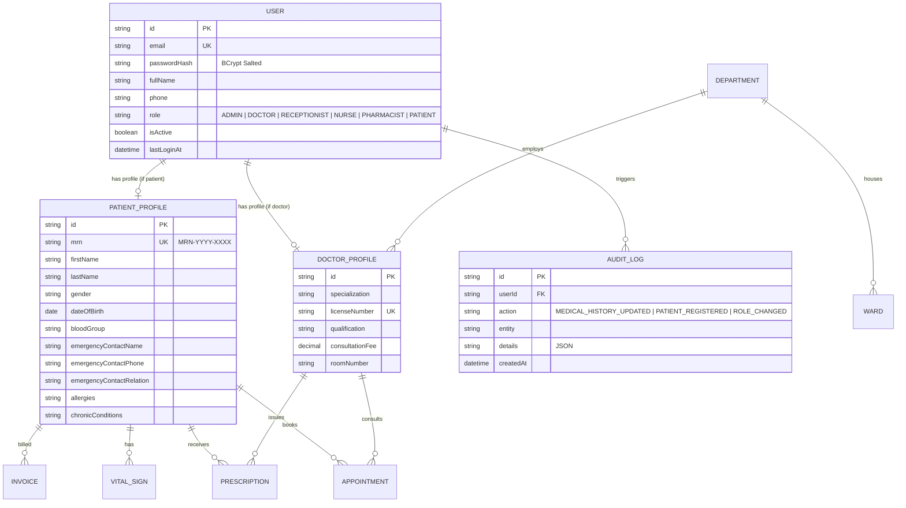

# 🏥 Smart Hospital Management System (HMS)

> **Cloud-Based Healthcare Management & Clinical Operations Platform**  
> **Internship Project Submission — Module 1: Complete Deliverables (Days 1 — 5)**

---

## 📌 Project Overview
The **Cloud-Based Hospital Management System (HMS)** is an enterprise-grade healthcare web application designed to automate clinical workflows, patient registration, outpatient scheduling, EHR consultations, pharmacy dispensing, inpatient bed tracking, and billing.

---

## 🚀 Module 1 Deliverables Summary (All 5 Days Completed)

| Day | Date | Focus Scope | Deliverable Status |
|---|---|---|---|
| **Day 1** | Aug 24 | DB Schema Design & Full Stack Scaffolding | ✅ **Completed & Verified** |
| **Day 2** | Aug 25 | JWT Auth (Login/Signup/Logout & Password Hashing) | ✅ **Completed & Verified** |
| **Day 3** | Aug 26 | Role-Based Access Control (Admin, Doctor, Receptionist, Nurse, Patient) | ✅ **Completed & Verified** |
| **Day 4** | Aug 27 | Patient Registration & Demographic Forms (Auto MRN ID) | ✅ **Completed & Verified** |
| **Day 5** | Aug 28 | Patient Search, Medical History & Emergency Contacts | ✅ **Completed & Verified** |

---

## 🔍 Module 1 — Day 5 Deliverables (Aug 28, 2026)

### ✅ What was completed on Day 5:
1. **Multi-Criteria Patient Search Engine (`medicalHistoryController.js`):**
   - Search across MRN (`MRN-2026-XXXX`), Full Name, Phone, National ID (CNIC), and Emergency Contact.
   - Filter chips by Blood Group (`A+`, `B+`, `O+`, `AB+`), Allergy Alerts, and Chronic Conditions.
2. **Longitudinal EHR & Medical History Timeline (`medicalHistoryRoutes.js`):**
   - Aggregated clinical consultation visits, SOAP notes (Subjective, Objective, Assessment, Plan), vital signs time-series (BP, Pulse, Temp, SpO2, BMI), and issued e-prescriptions.
   - Chronologically unified clinical dossier for attending physicians.
3. **Emergency Contact & Next-of-Kin Management (`updateEmergencyContact`):**
   - Rapid emergency contact updater with guardian relationship tagging and security audit logging.
4. **Allergy & Chronic Illness Safety Registry (`updateMedicalBaseline`):**
   - Dynamic drug/food allergy tracking and chronic condition baseline updates.
5. **Interactive Day 5 EHR & Patient Search Dashboard (`Day5MedicalHistoryExplorer.jsx`):**
   - Instant search console with auto-complete.
   - Longitudinal medical timeline with visual event badges.
   - 1-Click emergency contact and allergy baseline editor modals.
6. **Automated Day 5 Test Suite (`test-medical-history.js`):**
   - 16 automated assertions verifying multi-criteria search, timeline aggregation, emergency updates, allergy expansions, and audit logging.

---

## 📋 Module 1 — Day 4 Deliverables (Aug 27, 2026)
- **Collision-Safe MRN Generator (`mrnGenerator.js`):** `MRN-YYYY-XXXX`.
- **Demographic Intake Validation & API (`patientController.js`):** Registration & demographic endpoints.
- **Automated Tests:** 17/17 tests passed (`test-patient-registration.js`).

---

## 🛡️ Module 1 — Day 3 Deliverables (Aug 26, 2026)
- **Multi-Role RBAC System (`rbacConfig.js`):** 6 Roles, 20+ permissions matrix, route guards.
- **Automated Tests:** 36/36 tests passed (`test-rbac.js`).

---

## 🔐 Module 1 — Day 2 Deliverables (Aug 25, 2026)
- **JWT Engine & BCrypt Security (`jwt.js`, `password.js`):** 10 Salt rounds, token issuance, inspect-token.
- **Automated Tests:** 23/23 tests passed (`test-auth.js`).

---

## 🗄️ Module 1 — Day 1 Deliverables (Aug 24, 2026)
- **11 Prisma Relational Models:** Multi-role schema, doctor/patient profiles, departments, beds, audit logs.

---

## 🏗️ Entity Relationship Diagram (ERD)



---

## 🛠️ Automated Test Suites (92 Total Passed Assertions)

| Test Suite | Deliverable Scope | Assertions | Status |
|---|---|---|---|
| `test-auth.js` | Day 2: JWT Auth, Hashing, Token Tampering | 23 Assertions | ✅ **PASS (100%)** |
| `test-rbac.js` | Day 3: RBAC Matrix, Route Guards & Admin | 36 Assertions | ✅ **PASS (100%)** |
| `test-patient-registration.js` | Day 4: Auto-MRN & Demographic Intake | 17 Assertions | ✅ **PASS (100%)** |
| `test-medical-history.js` | Day 5: Multi-Criteria Search & Longitudinal EHR | 16 Assertions | ✅ **PASS (100%)** |
| **Total Test Coverage** | **Module 1 (Days 1 — 5)** | **92 Assertions** | ✅ **100% Passed** |

---

## ⚡ Quick Start & Run

### 1. Backend Server
```powershell
cd server
npm install
npx prisma generate
npx prisma db push
node prisma/seed.js
node test-auth.js                 # 23 tests
node test-rbac.js                 # 36 tests
node test-patient-registration.js # 17 tests
node test-medical-history.js      # 16 tests
npm run dev
```

### 2. Frontend Client
```powershell
cd ../client
npm install
npm run dev
```

---

**Author:** [ansariking51214](https://github.com/ansariking51214)  
**Repository:** [Smart-Hospital-management-system](https://github.com/ansariking51214/Smart-Hospital-management-system.git)
