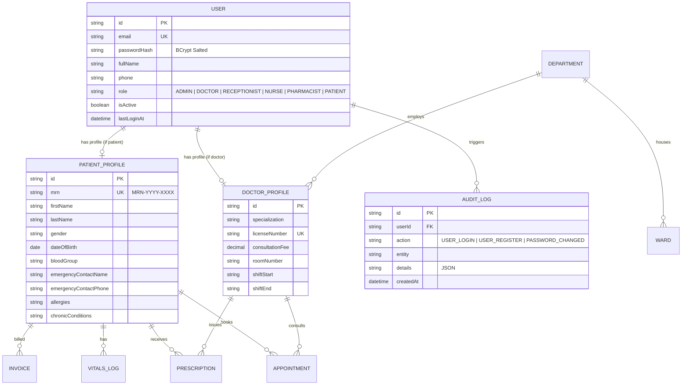

# 🏥 Smart Hospital Management System (HMS)

> **Cloud-Based Healthcare Management & Clinical Operations Platform**  
> **Internship Project Submission — Module 1: Day 1 & Day 2 Deliverables**

---

## 📌 Project Overview
The **Cloud-Based Hospital Management System (HMS)** is an enterprise-grade healthcare web application designed to automate clinical workflows, patient registration, outpatient scheduling, EHR consultations, pharmacy dispensing, inpatient bed tracking, and billing.

---

## 🚀 Module 1 Deliverables Summary

| Day | Date | Focus Scope | Deliverable Status |
|---|---|---|---|
| **Day 1** | Aug 24 | DB Schema Design & Full Stack Scaffolding | ✅ **Completed & Verified** |
| **Day 2** | Aug 25 | JWT Auth (Login/Signup/Logout & Password Hashing) | ✅ **Completed & Verified** |
| **Day 3** | Aug 26 | Role-Based Access Control (Admin, Doctor, Receptionist, Patient) | ⏳ *Next Milestone* |
| **Day 4** | Aug 27 | Patient Registration & Demographic Forms (Auto MRN ID) | ⏳ *Upcoming* |
| **Day 5** | Aug 28 | Patient Search, Medical History & Emergency Contacts | ⏳ *Upcoming* |

---

## 🔐 Module 1 — Day 2 Deliverables (Aug 25, 2026)

### ✅ What was completed on Day 2:
1. **Cryptographic Password Hashing (`bcryptjs`):**
   - Implemented `hashPassword` and `comparePassword` with 10 salt rounds.
   - Live password strength validation (length, uppercase, lowercase, numbers, special characters).
2. **JSON Web Token (JWT) Authentication (`jsonwebtoken`):**
   - Token issuance with standard payload claims (`id`, `email`, `role`, `fullName`, `mrn`).
   - Token signature verification and tamper detection (`HS256`).
   - Configurable session expiration (`JWT_EXPIRES_IN=7d`).
3. **Authentication REST Endpoints:**
   - `POST /api/auth/register` — User signup, input validation, bcrypt hashing, auto-MRN generation for patients, audit log creation, and token generation.
   - `POST /api/auth/login` — Credential verification, account status checks, last login recording, audit logging, and JWT issuance.
   - `POST /api/auth/logout` — Session termination with audit log tracking.
   - `GET /api/auth/me` — Protected endpoint returning current user profile and RBAC metadata.
   - `POST /api/auth/change-password` — Secure password update requiring old password verification.
   - `POST /api/auth/inspect-token` — Token decoder returning cryptographic claims and remaining lifespan.
   - `GET /api/auth/audit-logs` — Immutable security log stream for authentication events.
4. **Security & Route Guard Middleware:**
   - `authenticateToken` — Validates Bearer tokens from the `Authorization` header, handles expired (`TOKEN_EXPIRED`) and tampered (`TOKEN_INVALID`) tokens, and verifies active user status in the database.
   - `requireRoles` — Granular role-based guard middleware.
   - `validateRegister`, `validateLogin`, `validateChangePassword` — Request validation middleware.
5. **Interactive Day 2 Security & Auth Dashboard:**
   - **Live Token Inspector:** Decodes raw JWTs into Header, Payload, and Signature with live countdown timer.
   - **BCrypt Playground:** Interactive salt generation and password verification tester.
   - **Live API Tester:** One-click execution of 200 OK, 401 Unauthorized, and 403 Forbidden scenarios.
   - **Real-Time Security Audit Trail:** Live table of recent authentication events.
   - **Auth Modal:** Sign in, registration, and 1-click persona quick-login switcher.

---

## 🏗️ Entity Relationship Diagram (ERD)



---

## 🛠️ Tech Stack

| Layer | Technologies |
|---|---|
| **Frontend** | React 18, Vite, Tailwind CSS, Lucide React Icons, Axios |
| **Backend API** | Node.js, Express.js (ESM), Helmet, Morgan, CORS |
| **Authentication** | JSON Web Tokens (JWT), BCrypt.js, RBAC Middleware |
| **Database & ORM** | Prisma ORM, SQLite (Zero-config local) / PostgreSQL compatible |
| **Utilities** | Auto MRN Generator, Custom Error Handlers, Test Suites |

---

## 📂 Project Structure

```
Smart-Hospital-management-system/
├── package.json
├── .gitignore
├── README.md
├── push-to-github.bat                 # 1-Click push script (Windows)
├── push-to-github.ps1                 # PowerShell push script
│
├── server/                            # Express Backend REST API
│   ├── prisma/
│   │   ├── schema.prisma              # 11 Relational Prisma Models
│   │   └── seed.js                    # Database seed fixtures
│   ├── src/
│   │   ├── config/db.js               # Prisma client singleton
│   │   ├── controllers/
│   │   │   ├── authController.js      # Day 2: JWT Login, Signup, Logout, Audit
│   │   │   ├── healthController.js    # Health diagnostics
│   │   │   └── schemaController.js    # Database schema reflection
│   │   ├── middleware/
│   │   │   ├── authMiddleware.js      # Day 2: JWT Bearer & RBAC validation
│   │   │   ├── validateAuth.js        # Input validation middleware
│   │   │   ├── errorHandler.js        # Global error interceptor
│   │   │   └── requestLogger.js       # Request logging
│   │   ├── routes/
│   │   │   ├── api.js                 # API route aggregator
│   │   │   ├── authRoutes.js          # Day 2: Auth REST endpoints
│   │   │   ├── healthRoutes.js
│   │   │   └── schemaRoutes.js
│   │   ├── utils/
│   │   │   ├── jwt.js                 # JWT sign, verify, decode utilities
│   │   │   ├── password.js            # BCrypt hash & compare utilities
│   │   │   └── mrnGenerator.js        # Sequential MRN generator
│   │   ├── app.js
│   │   └── server.js
│   ├── test-auth.js                   # Automated Day 2 test suite (23 assertions)
│   └── package.json
│
└── client/                            # React + Vite Frontend
    ├── src/
    │   ├── components/
    │   │   ├── Day2AuthExplorer.jsx   # Interactive JWT & BCrypt Security Hub
    │   │   ├── AuthModal.jsx          # Login, Registration & Demo Switcher
    │   │   ├── Day1SchemaExplorer.jsx # Schema & ERD inspector
    │   │   ├── SeedDataViewer.jsx     # Clinical fixtures viewer
    │   │   ├── Navbar.jsx             # Top bar with Auth user pill
    │   │   ├── Sidebar.jsx            # Module & Day navigation
    │   │   └── StatsCards.jsx         # System counters
    │   ├── context/
    │   │   └── AuthContext.jsx        # React Auth Provider & state hook
    │   ├── services/
    │   │   └── api.js                 # Axios instance with Bearer interceptor
    │   ├── App.jsx
    │   └── index.css
    └── package.json
```

---

## ⚡ Quick Start & Run

### 1. Backend Server
```powershell
cd server
npm install
npx prisma generate
npx prisma db push
node prisma/seed.js
node test-auth.js      # Run 23 automated auth tests
npm run dev
```
*Backend runs on `http://localhost:5000` (Health: `/api/health`)*

### 2. Frontend Client
```powershell
cd ../client
npm install
npm run dev
```
*Frontend runs on `http://localhost:5173`*

---

## 🔐 Seed Demo Credentials for Testing

| Role | Email | Password | Access Scope |
|---|---|---|---|
| **Super Admin** | `admin@hms.hospital` | `Admin@12345` | Full System Management & Audit |
| **Cardiologist** | `dr.sarah@hms.hospital` | `Password@123` | Doctor Consultation & EHR |
| **Pediatrician** | `dr.ahmed@hms.hospital` | `Password@123` | OPD & Pediatric Consultation |
| **Receptionist** | `receptionist@hms.hospital` | `Password@123` | Patient Registration & Tokens |
| **Nurse** | `nurse.maria@hms.hospital` | `Password@123` | Triage & Vital Signs Recording |
| **Patient** | `david.miller@gmail.com` | `Password@123` | Patient Portal (MRN-2026-0001) |

---

**Author:** [ansariking51214](https://github.com/ansariking51214)  
**Repository:** [Smart-Hospital-management-system](https://github.com/ansariking51214/Smart-Hospital-management-system.git)
