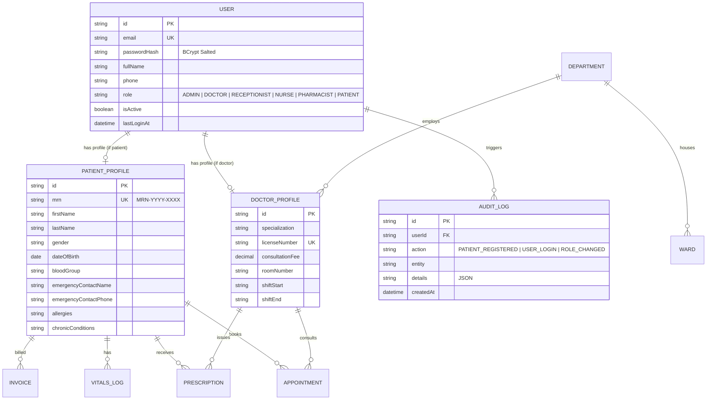

# 🏥 Smart Hospital Management System (HMS)

> **Cloud-Based Healthcare Management & Clinical Operations Platform**  
> **Internship Project Submission — Module 1: Day 1, Day 2, Day 3 & Day 4 Deliverables**

---

## 📌 Project Overview
The **Cloud-Based Hospital Management System (HMS)** is an enterprise-grade healthcare web application designed to automate clinical workflows, patient registration, outpatient scheduling, EHR consultations, pharmacy dispensing, inpatient bed tracking, and billing.

---

## 🚀 Module 1 Deliverables Summary

| Day | Date | Focus Scope | Deliverable Status |
|---|---|---|---|
| **Day 1** | Aug 24 | DB Schema Design & Full Stack Scaffolding | ✅ **Completed & Verified** |
| **Day 2** | Aug 25 | JWT Auth (Login/Signup/Logout & Password Hashing) | ✅ **Completed & Verified** |
| **Day 3** | Aug 26 | Role-Based Access Control (Admin, Doctor, Receptionist, Nurse, Patient) | ✅ **Completed & Verified** |
| **Day 4** | Aug 27 | Patient Registration & Demographic Forms (Auto MRN ID) | ✅ **Completed & Verified** |
| **Day 5** | Aug 28 | Patient Search, Medical History & Emergency Contacts | ⏳ *Next Milestone* |

---

## 📋 Module 1 — Day 4 Deliverables (Aug 27, 2026)

### ✅ What was completed on Day 4:
1. **Collision-Safe Sequential Medical Record Number (MRN) Generator (`mrnGenerator.js`):**
   - Format: `MRN-YYYY-XXXX` (e.g. `MRN-2026-0001`, `MRN-2026-0002`).
   - Annual resetting, zero-padded 4-digit sequential index, and thread-safe database lookup.
2. **Comprehensive Demographic Intake Model & Validation (`validatePatient.js`):**
   - Personal Demographics: First Name, Last Name, Date of Birth (with age calculation), Gender (`MALE`, `FEMALE`, `OTHER`), Blood Group (`A+`, `A-`, `B+`, `B-`, `AB+`, `AB-`, `O+`, `O-`), National ID/CNIC.
   - Contact & Address: Primary contact phone, optional email account creation, residential street address.
   - Emergency Contact & Guardian: Relative name, relationship (`Spouse`, `Parent`, `Sibling`, `Guardian`), emergency phone.
   - Medical Baseline: Drug/food allergies registry, chronic illness history (Hypertension, Diabetes, Asthma).
3. **Patient REST API Controller & Endpoints (`patientController.js` & `patientRoutes.js`):**
   - `POST /api/patients/register` — Front-desk or patient self-registration with auto-MRN generation and user profile linkage.
   - `GET /api/patients` — Paginated patient directory with search (name, MRN, phone) and filter (blood group, gender).
   - `GET /api/patients/:idOrMrn` — Single patient medical dossier retrieval with appointments and vitals history.
   - `PUT /api/patients/:id` — Demographic and contact information updater with audit logging.
   - `GET /api/patients/stats/overview` — Registration metrics, gender breakdown, and blood group distribution.
4. **Interactive Day 4 Patient Registration Suite (`Day4PatientRegistration.jsx`):**
   - **4-Section Intake Form:** Personal demographics, contact, emergency guardian, and medical baseline.
   - **Digital Patient ID Card Modal:** Instant issuance of patient card with MRN badge, blood group pill, and emergency contact details.
   - **Live Patient Directory:** Real-time registry search, filtering, and dossier inspection.
5. **Automated Patient Registration Test Suite (`test-patient-registration.js`):**
   - 17 automated assertions verifying MRN format, database insertion, demographic retrieval, updates, and audit logging.

---

## 🛡️ Module 1 — Day 3 Deliverables (Aug 26, 2026)

### ✅ What was completed on Day 3:
1. **Multi-Role Access Control Architecture (`rbacConfig.js`):**
   - Formalized 6 system roles: `ADMIN`, `DOCTOR`, `RECEPTIONIST`, `NURSE`, `PHARMACIST`, `PATIENT`.
   - Granular Permissions Matrix allocating 20+ fine-grained capabilities.
2. **Route Guard & Permission Middleware (`authMiddleware.js`):**
   - `requireRoles(...roles)` and `requirePermission(permission)` route guards with strict `403 Forbidden` checks.
3. **RBAC REST Endpoints & Dashboard (`rbacController.js` & `Day3RbacExplorer.jsx`):**
   - Role matrix endpoints, admin user management, 1-click persona switching, and live route guard simulator.
4. **Automated RBAC Test Suite (`test-rbac.js`):**
   - 36 automated assertions verifying role hierarchy and route guards.

---

## 🔐 Module 1 — Day 2 Deliverables (Aug 25, 2026)

### ✅ What was completed on Day 2:
1. **BCrypt Password Hashing (`password.js`):** Salted hashing (10 rounds) and strength validation.
2. **JWT Authentication Engine (`jwt.js`):** Signed `HS256` tokens with configurable lifespan.
3. **Auth REST Endpoints & Dashboard (`authController.js` & `Day2AuthExplorer.jsx`):** Live Token Inspector, BCrypt playground, and 23 automated tests (`test-auth.js`).

---

## 🏗️ Entity Relationship Diagram (ERD)



---

## 🛠️ Tech Stack & Test Status

| Layer | Technologies | Test Suite Assertions |
|---|---|---|
| **Frontend** | React 18, Vite, Tailwind CSS, Lucide Icons, Axios | Production Build Verified (0 errors) |
| **Backend REST** | Node.js, Express.js (ESM), Helmet, Morgan, CORS | Express Endpoints Verified |
| **Day 2 Auth** | JWT (`jsonwebtoken`), BCrypt (`bcryptjs`) | **23/23 Tests Passed** (`test-auth.js`) |
| **Day 3 RBAC** | Multi-role route guards, Permissions matrix | **36/36 Tests Passed** (`test-rbac.js`) |
| **Day 4 Patients** | Auto MRN generator (`MRN-YYYY-XXXX`), Demographics | **17/17 Tests Passed** (`test-patient-registration.js`) |
| **Total Automated Tests** | **76 Passed Assertions across 3 Suites** | ✅ **100% Pass Rate** |

---

## ⚡ Quick Start & Run

### 1. Backend Server
```powershell
cd server
npm install
npx prisma generate
npx prisma db push
node prisma/seed.js
node test-auth.js                 # 23 tests
node test-rbac.js                 # 36 tests
node test-patient-registration.js # 17 tests
npm run dev
```
*Backend runs on `http://localhost:5000`*

### 2. Frontend Client
```powershell
cd ../client
npm install
npm run dev
```
*Frontend runs on `http://localhost:5173`*

---

**Author:** [ansariking51214](https://github.com/ansariking51214)  
**Repository:** [Smart-Hospital-management-system](https://github.com/ansariking51214/Smart-Hospital-management-system.git)
