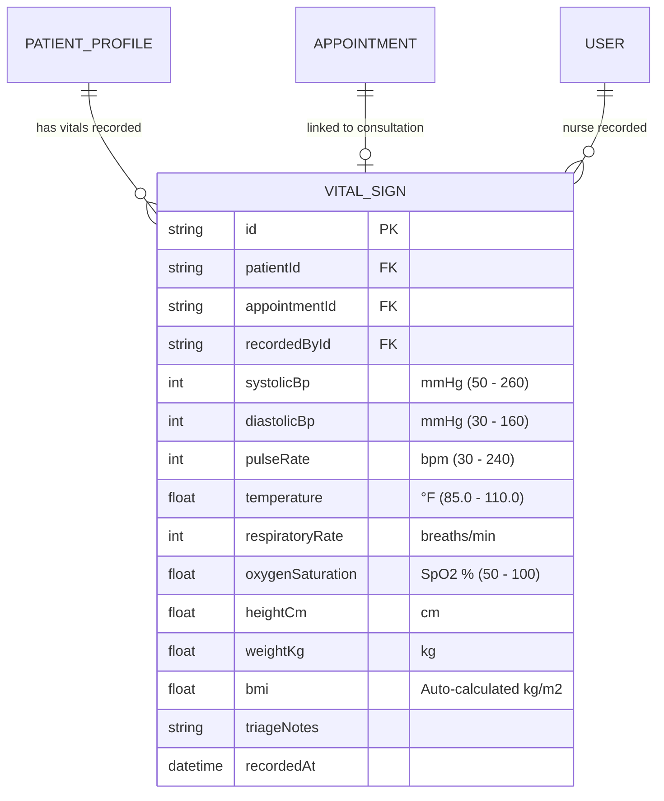

# 🏥 Smart Hospital Management System (HMS)

> **Cloud-Based Healthcare Management & Clinical Operations Platform**  
> **Student / Intern Name:** Muhammad Tabish Ahmad  
> **Internship ID:** `ZYNVEX-CERT-1101`  
> **Repository:** [Smart-Hospital-management-system](https://github.com/ansariking51214/Smart-Hospital-management-system)

---

## 📌 Project Overview
The **Smart Hospital Management System (HMS)** is an enterprise-grade full-stack healthcare web application designed to automate clinical operations, outpatient scheduling, dynamic time slot booking, electronic health records (EHR), physician shift rostering, OPD live queue & token calling, nurse vitals triage desk & early warning scoring, pharmacy dispensing, inpatient bed tracking, and billing workflows.

---

## 🚀 Internship Syllabus & Milestone Progress

### ✅ Module 1: Authentication, RBAC & Patient Registration (100% Completed)
| Day | Date | Focus Scope | Key Deliverables | Status |
|:---:|:---:|:---|:---|:---:|
| **Day 1** | Aug 24 | DB Schema Design & Scaffolding | 11 Prisma Relational Models, SQLite Migration, Seed Data Fixtures | ✅ **Completed** |
| **Day 2** | Aug 25 | JWT Auth & Password Security | BCrypt (10 Salt Rounds), Signed JWT Engine, Token Inspector, Audit Trail | ✅ **Completed** |
| **Day 3** | Aug 26 | Role-Based Access Control (RBAC) | 6 Roles, 20+ Permissions Matrix, Dynamic Route Guards, Admin Role Table | ✅ **Completed** |
| **Day 4** | Aug 27 | Patient Registration & Auto MRN | Sequential Auto-MRN (`MRN-2026-XXXX`), 4-Step Clinical Intake, Digital ID Card | ✅ **Completed** |
| **Day 5** | Aug 28 | Patient Search & Medical History | Multi-Criteria Search, Longitudinal EHR Timeline, Emergency Contact Center | ✅ **Completed** |

---

### 🩺 Module 2: Doctor Rostering & OPD Management (In Progress)
| Day | Date | Focus Scope | Key Deliverables | Status |
|:---:|:---:|:---|:---|:---:|
| **Day 1** | Aug 31 / Sep 01 | Doctor Profile & Shift Rostering | Physician Onboarding, Shift Schedules, Weekly Rosters, Real-time Duty Board | ✅ **Completed** |
| **Day 2** | Sep 02 | Slot Booking Engine & OPD Scheduling | Dynamic Slot Generation, Collision Guard, Queue Token Issuance & Rescheduling | ✅ **Completed** |
| **Day 3** | Sep 03 | OPD Queue & Token Display System | Live Patient Calling Board, Sequential Tokens, TV Display Screen, Triage Desk | ✅ **Completed** |
| **Day 4** | Sep 04 | **Nurse Vitals Triage Desk & Alerts** | **Pre-Consultation Vitals, Auto-BMI, NEWS Early Warning Severity Alerts (Green/Amber/Red)** | ✅ **Completed & Verified** |
| **Day 5** | Sep 05 | Appointment Status Flow | Check-In, In-Consultation & Completion Workflow | ⏳ *Next Milestone* |

---

## 🩺 Module 2 — Day 4 Deliverables: Nurse Vitals Triage Desk & Early Warning System

### 1. Clinical Vitals Engine & Triage Risk Classifier
* **Controller:** [`server/src/controllers/nurseTriageController.js`](https://github.com/ansariking51214/Smart-Hospital-management-system/blob/main/server/src/controllers/nurseTriageController.js)
* **Routes:** [`server/src/routes/nurseTriageRoutes.js`](https://github.com/ansariking51214/Smart-Hospital-management-system/blob/main/server/src/routes/nurseTriageRoutes.js) mounted on `/api/triage`
* **Validation:** [`server/src/middleware/validateNurseTriage.js`](https://github.com/ansariking51214/Smart-Hospital-management-system/blob/main/server/src/middleware/validateNurseTriage.js)

| Method | Endpoint | Access | Purpose |
|:---|:---|:---:|:---|
| `POST` | `/api/triage/vitals` | Nurse / Doctor / Admin | Records BP, Pulse, SpO2, Temp, RR, Height, Weight; auto-computes BMI and evaluates NEWS triage risk level (`GREEN`, `AMBER`, `RED`) |
| `GET` | `/api/triage/queue` | Authenticated | Pre-consultation nurse triage queue (checked-in patients pending vital signs screening) |
| `GET` | `/api/triage/patient/:patientId/history` | Authenticated | Longitudinal vitals time-series history for clinical trend analysis |
| `GET` | `/api/triage/stats/overview` | Authenticated | Triage metrics: Total Vitals Today, Red Critical Alerts, Amber Urgent Alerts, Green Stable |

### 2. Interactive Frontend Nurse Triage Explorer
* **React Component:** [`client/src/components/Day4NurseTriageExplorer.jsx`](https://github.com/ansariking51214/Smart-Hospital-management-system/blob/main/client/src/components/Day4NurseTriageExplorer.jsx)
* **Features:**
  * **Interactive Intake Form:** Real-time dual-slider and numerical entry with immediate auto-BMI calculation and color category badges (`Underweight`, `Normal`, `Overweight`, `Obese`).
  * **Live Early Warning Score (NEWS / Triage Risk Badge):** Real-time physiological alert generation for acute hypoxemia (SpO2 < 90%), hypertensive crisis (BP > 180/110), tachycardia, and pyrexia.
  * **Pre-Consultation Triage Queue:** 1-Click triage intake for waiting patients.
  * **Longitudinal Vitals Trend Log:** Historical time-series record with clinical annotations.

---

## 🏗️ Architecture & Entity Relationship Diagram (ERD)



---

## 🧪 Automated Test Suite Coverage (160 Total Passed Assertions)

| Test Suite File | Module & Day Scope | Assertions | Result |
|:---|:---|:---:|:---:|
| [`server/test-auth.js`](https://github.com/ansariking51214/Smart-Hospital-management-system/blob/main/server/test-auth.js) | M1 Day 2: JWT Auth, Hashing, Token Tampering | 23 | ✅ **100% PASS** |
| [`server/test-rbac.js`](https://github.com/ansariking51214/Smart-Hospital-management-system/blob/main/server/test-rbac.js) | M1 Day 3: RBAC Matrix, Route Guards & Admin | 36 | ✅ **100% PASS** |
| [`server/test-patient-registration.js`](https://github.com/ansariking51214/Smart-Hospital-management-system/blob/main/server/test-patient-registration.js) | M1 Day 4: Auto-MRN & Demographic Intake | 17 | ✅ **100% PASS** |
| [`server/test-medical-history.js`](https://github.com/ansariking51214/Smart-Hospital-management-system/blob/main/server/test-medical-history.js) | M1 Day 5: Multi-Criteria Search & Longitudinal EHR | 16 | ✅ **100% PASS** |
| [`server/test-doctor-roster.js`](https://github.com/ansariking51214/Smart-Hospital-management-system/blob/main/server/test-doctor-roster.js) | M2 Day 1: Doctor Profile & Shift Rostering | 18 | ✅ **100% PASS** |
| [`server/test-appointment-booking.js`](https://github.com/ansariking51214/Smart-Hospital-management-system/blob/main/server/test-appointment-booking.js) | M2 Day 2: Slot Booking Engine & OPD Scheduling | 18 | ✅ **100% PASS** |
| [`server/test-opd-queue.js`](https://github.com/ansariking51214/Smart-Hospital-management-system/blob/main/server/test-opd-queue.js) | M2 Day 3: OPD Queue & Live Token Display | 18 | ✅ **100% PASS** |
| [`server/test-nurse-triage.js`](https://github.com/ansariking51214/Smart-Hospital-management-system/blob/main/server/test-nurse-triage.js) | **M2 Day 4: Nurse Vitals Triage & Early Warning Alerts** | 14 | ✅ **100% PASS** |
| **Total Test Coverage** | **All Modules (M1 Complete + M2 Days 1-4)** | **160 Assertions** | ✅ **100% Passed** |

---

## ⚡ Quick Start & Setup Guide

### 1. Backend Server Setup
```powershell
cd server
npm install
npx prisma generate
npx prisma db push
node prisma/seed.js

# Run All 8 Automated Test Suites (160 Assertions):
node test-auth.js
node test-rbac.js
node test-patient-registration.js
node test-medical-history.js
node test-doctor-roster.js
node test-appointment-booking.js
node test-opd-queue.js
node test-nurse-triage.js

# Start Backend Server (Port 5000):
npm run dev
```

### 2. Frontend Client Setup
```powershell
cd ../client
npm install
npm run dev
```
Open **[http://localhost:5173](http://localhost:5173)** in your browser.

---

**Author:** [ansariking51214](https://github.com/ansariking51214)  
**Internship ID:** `ZYNVEX-CERT-1101`  
**Repository:** [https://github.com/ansariking51214/Smart-Hospital-management-system](https://github.com/ansariking51214/Smart-Hospital-management-system)
